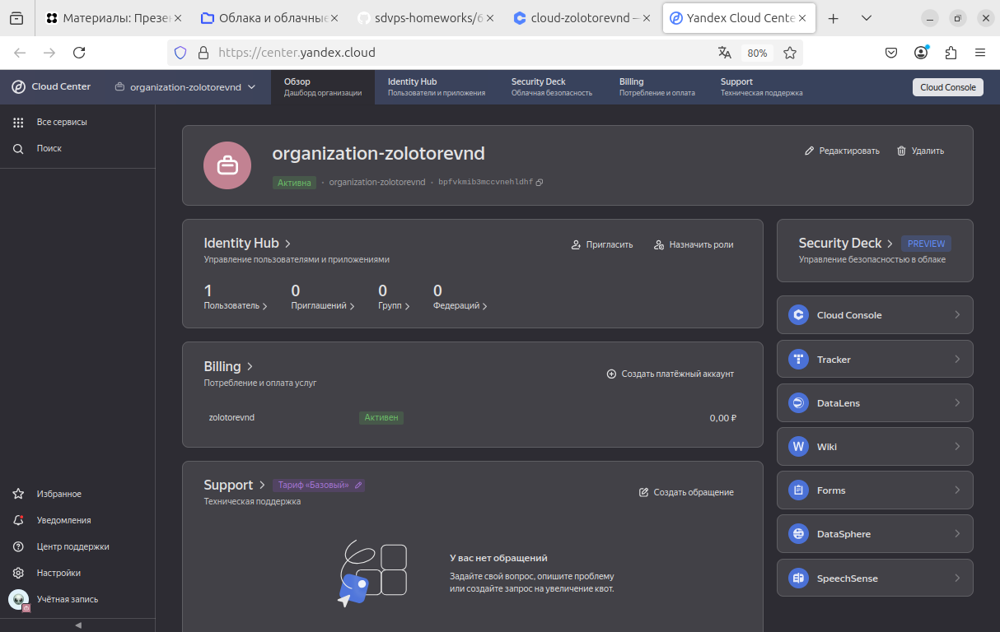
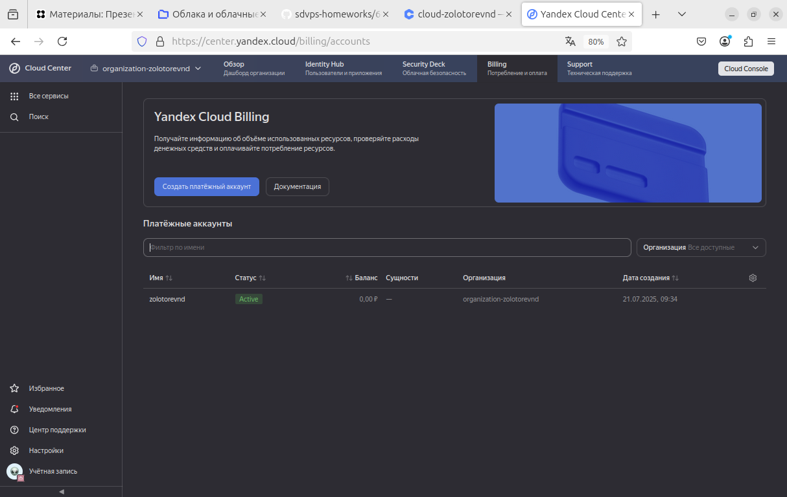
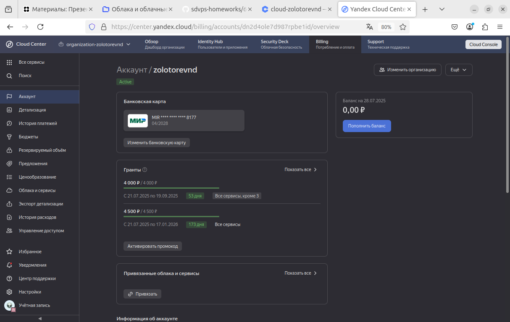
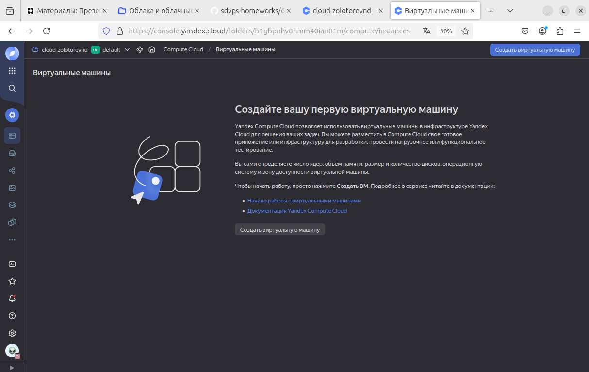
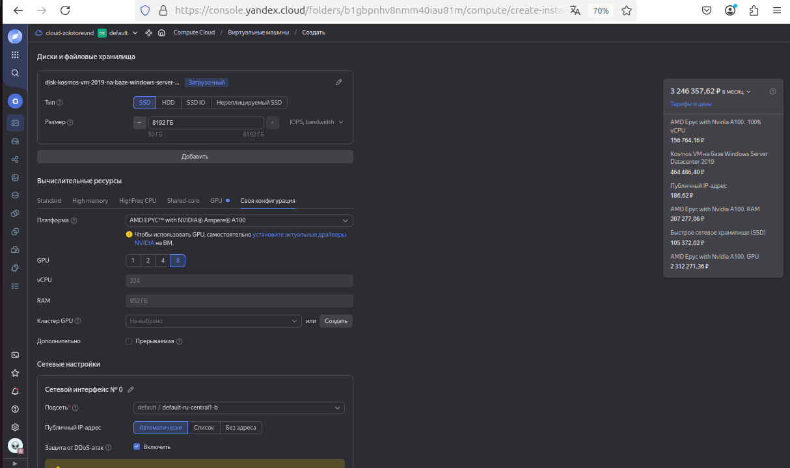
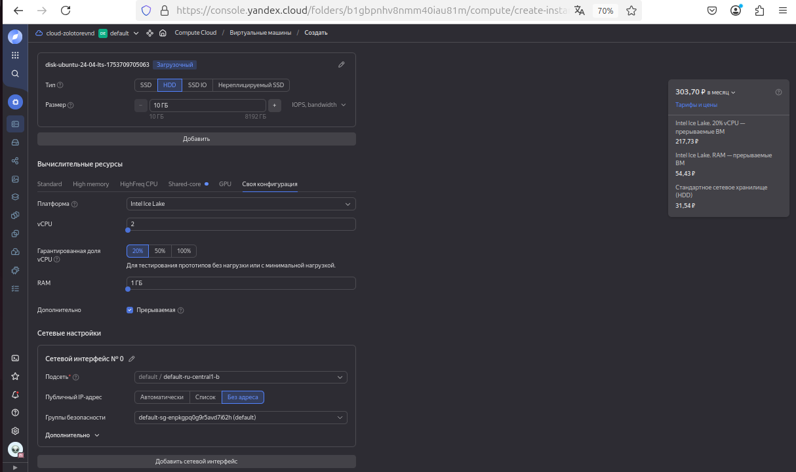

# Домашнее задание к занятию «Виртуализация и облачные решения: AWS, GCP, Yandex Cloud, OpenStack»
### Золоторев Н.Д.

### Задание 1

Ответьте на вопрос в свободной форме.

Чем частное облако отличается от общедоступного, публичного и гибридного?

### Решение 1

Частное облако — это облачная инфраструктура, которая предназначена для использования одной организацией. Оно обеспечивает высокий уровень безопасности и контроля, так как ресурсы не делятся с другими компаниями.

Общедоступное или публичное облако — это инфраструктура, предоставляемая провайдерами (например, AWS, Azure, Google Cloud), где ресурсы делятся между множеством пользователей. Это более экономичный вариант, но с меньшим уровнем контроля и безопасности.

Гибридное облако — это комбинация частных и публичных облаков, позволяющая использовать преимущества обоих. Например, важные данные хранятся в частном облаке, а менее чувствительные — в публичном, что обеспечивает баланс между безопасностью и экономией.

### Задание 2

Что обозначают: IaaS, PaaS, SaaS, CaaS, DRaaS, BaaS, DBaaS, MaaS, DaaS, NaaS, STaaS? Напишите примеры их использования.

### Решение 2

1. IaaS (Infrastructure as a Service) — инфраструктура как услуга. Предоставляет виртуальные машины, хранилища и сети.
   Пример: Amazon EC2, Google Cloud Compute Engine.
2. PaaS (Platform as a Service) — платформа как услуга. Обеспечивает среду для разработки и развертывания приложений.
   Пример: Google App Engine, Microsoft Azure App Service.

3. SaaS (Software as a Service) — программное обеспечение как услуга. Предлагает готовые приложения через интернет.
   Пример: Gmail, Salesforce.

4. CaaS (Container as a Service) — контейнеры как услуга. Обеспечивает управление и оркестрацию контейнеров.
   Пример: Google Kubernetes Engine, Azure Container Instances.

5. DRaaS (Disaster Recovery as a Service) — аварийное восстановление как услуга. Обеспечивает резервное копирование и восстановление данных.
   Пример: Zerto, Veeam Cloud Connect.

6. BaaS (Backup as a Service) — резервное копирование как услуга. Обеспечивает автоматическое создание резервных копий данных.
   Пример: Carbonite, Acronis.

7. DBaaS (Database as a Service) — базы данных как услуга. Предоставляет управляемые базы данных.
   Пример: Amazon RDS, Azure SQL Database.

8. MaaS (Monitoring as a Service) — мониторинг как услуга. Обеспечивает отслеживание состояния систем и приложений.
   Пример: Datadog, New Relic.

9. DaaS (Desktop as a Service) — рабочие столы как услуга. Предоставляет виртуальные рабочие столы пользователям.
   Пример: Amazon WorkSpaces, Citrix Virtual Apps.

10. NaaS (Network as a Service) — сеть как услуга. Обеспечивает управление сетевыми ресурсами и подключениями.
    Пример: Aryaka, Cisco NaaS.

11. STaaS (Storage as a Service) — хранилище как услуга. Предлагает облачное хранение данных.
    Пример: Dropbox, Google

### Задание 3

Ответьте на вопрос в свободной форме.

Напишите, какой вид сервиса предоставляется пользователю в ситуациях:

1. Всеми процессами управляет провайдер.
2. Вы управляете приложением и данными, остальным управляет провайдер.
3. Вы управляете операционной системой, средой исполнения, данными, приложениями, остальными управляет провайдер.
4. Вы управляете сетью, хранилищами, серверами, виртуализацией, операционной системой, средой исполнения, данными, приложениями.

### Решение 3

1. ПО как услуга (SaaS)
2. Платформа как услуга (PaaS)
3. Инфраструктура как услуга (IaaS)
4. Colocation

### Задание 4

Вы работаете ИТ-специалистом в своей компании. Перед вами встал вопрос: покупать физический сервер или арендовать облачный сервис от Yandex Cloud.

Выполните действия и приложите скриншоты по каждому этапу:

    Создать платёжный аккаунт:

    1. зайти в консоль;
    2. выбрать меню биллинг;
    3. зарегистрировать аккаунт.

    После регистрации выбрать меню в консоли Computer cloud.
    Приступить к созданию виртуальной машины.

Ответьте на вопросы в свободной форме:

   1. Какие ОС можно выбрать?
   2. Какие параметры сервера можно выбрать?
   3. Какие компоненты мониторинга можно создать?
   4. Какие системы безопасности предусмотрены?
   5. Как меняется цена от выбранных характеристик? Приведите пример самой дорогой и самой дешёвой конфигурации.

### Решение 4
1. 

2. Astra Linux, FreeBSD, RedOs, ALT Linux, Fedora, Ubuntu, CentOS, Debian и т.д.

3. Процессор, Оперативная память, Дисковые накопители, Сетевые настройки.

4.  1) В Marketplace во вкладке Безопасность есть 38 продуктов.
    2) Защита от DDoS-атак.

5. 
   
   

